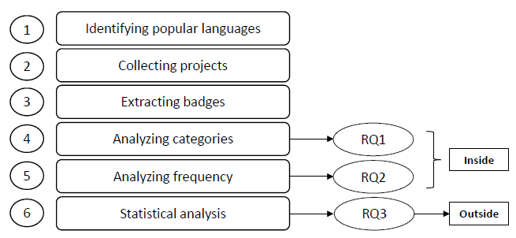
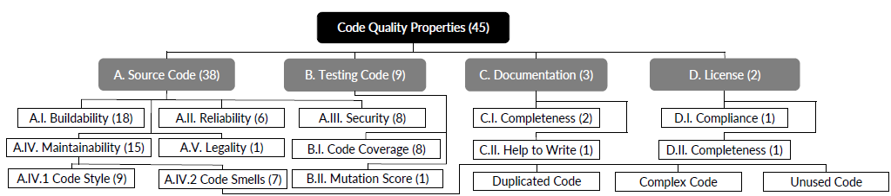

# 我们能从开源软件的质量保证标志(QA)中学到什么？
 基本信息
---
- **编号**：无
- **原标题**：What Can We Learn from Quality Assurance Badges in Open-Source Software?
- **原作者(汉字姓名暂定)**：$李峰^1, 娄怡玲^2, 谭鑫^3, 陈振鹏^4, 董金豪^1,李洋^1, 王璇之^1, 郝丹^{1*} \& 张路^1$
- **联系作者**：haodan@pku.edu.cn
- **原地址**： https://engine.scichina.com/doi/10.1007/s11432-022-3611-3
- **译者**：ChatGPT-4
- **研究机构(机翻)**：
  1. 北京大学计算机学院HCST教育部重点实验室,北京 100871;
  2. 普渡大学计算机科学系，西拉斐特，IN 47907，美国；
  3. 北京航空航天大学计算机科学与工程学院,北京 100191;
  4. 伦敦大学学院（UCL）计算机科学系，伦敦 WC1E 6BT，英国
- **译注**：该中文翻译**仅供参考**!!!

---

## 摘要
在开源软件（OSS）的开发中，许多开发人员使用徽章来提供软件的概述，并方便地分享一些关键特性/指标。在各种徽章中，质量保证（QA）徽章占据了很大比例，也是最普遍的，因为在软件开发中，QA的重要性至关重要，而无效的QA可能会导致异常或瑕疵。在本文中，我们关注开源项目中的QA徽章，它们直接并立即展示质量保证信息，目的是产生一些有趣的发现并提供实际的含义。我们从GitHub收集并分析了使用流行编程语言编写的100,000个项目，并对QA徽章内外进行了全面的实证研究。在QA徽章内，我们基于它们关注的属性为所有QA徽章建立了一个类别，这显示了开发人员使用的QA徽章的类型。然后，我们分析了QA徽章关注的属性的频率，以及属性组合，这些都显示了它们的使用状态。我们发现，虽然QA徽章关注各种属性，但开发人员对不同属性有不同的偏好。使用状态也在不同的编程语言之间有所不同。例如，用C编写的项目在很大程度上关注安全性。我们的发现也为开发人员和徽章提供商提供了含义。在QA徽章之外，我们对QA徽章和一些可能与代码质量，贡献质量和人气有关的软件指标进行了相关性分析。我们发现，QA徽章与各种软件指标有统计上显著的相关性。

**关键词**：质量保证，徽章，开源软件，代码质量，实证研究

引文 Li F、Lou Y、Tan X 等。 我们可以从开源软件的质量保证徽章中学到什么？ Sci China Inf Sci，供审阅

## 1 引言

开源软件（OSS）十分普遍[1-3]，为公司、政府和教育组织提供各种服务和产品[3]。与此同时，各种OSS开发平台也在迅速发展，例如GitHub（https://github.com/. 鉴于本文涉及了众多工具和网站，我们并未在每次提到它们时都给出链接，而是将所有链接统一罗列在`附录A`中）。为了帮助开发者更好地维护和理解软件的演变，OSS开发平台通常鼓励用基本介绍来记录每一个项目。例如，在最受欢迎的OSS平台GitHub上，开发者通常维护一个个人简介README文件，用来描述每个项目的概览，比如它的基本信息、安装指南或公告，这可以帮助用户和贡献者更容易了解项目。

除了传统的文本描述外，越来越多的项目在它们的README文件中包含了徽章。一个徽章就像是一张图像，描述一个项目的某些属性。每个徽章都有一个外部服务提供商支持，提供图像并在上面展示信息。通常，一个徽章可以描述关于QA、依赖性管理等信息。

徽章的日益普及也引起了研究者的关注。特别是，Trockman等人[4]对npm生态系统中的徽章进行了第一个大规模的实证研究，并确认许多徽章确实对用户和贡献者都是相当可靠的信号。他们的工作进一步总结了五种常见类型的徽章，详细介绍了QA、依赖性管理、信息、人气和支持等方面。其中，QA徽章是最普遍的，占据了所有徽章的最大比例。例如，31.5%的研究项目采用了由Travis CI提供的构建状态徽章。这样的观察是可以预料的，因为QA对于OSS来说是至关重要的。至今，文献中已经广泛研究了质量保证[5-9]，并提出并整合了各种QA工具到OSS平台，这进一步导致了QA徽章的普及。

然而，尽管QA徽章在实践中已被广泛使用，但他们在野外的使用状态，或者他们对质量保证的实际影响仍然未知。虽然Trockman等人[4]进行了第一次对总体徽章的研究，但之前的研究没有专门关注QA徽章。受他们的启发，在本文中，我们介绍了对开源软件中QA徽章的第一次全面研究，以调查他们在实践中的使用状态和含义。我们首先构建一个大规模数据集，包含从10种流行编程语言中的最受欢迎的100,000个GitHub项目中收集的57,363个QA徽章。然后，我们构建了一个关注QA徽章的属性的分类。基于这些数据，我们对QA徽章内部和外部进行了我们的实证研究。

首先，我们进行了对QA徽章内部的分析。具体来说，面对开源生态系统中的各种QA徽章，我们对开发人员关注哪些软件属性（例如，可维护性，安全性）以及不同徽章和属性的使用状态感到好奇。由于我们甚至不知道开发者常用什么样的QA徽章，所以我们首先通过构建一个关注QA徽章的属性的类别来描述现有QA徽章的全貌，这有助于很好地理解OSS项目中QA的当前状态。然后，在对QA徽章有了整体的了解并构建了一个类别后，我们观察了每个徽章类别的频率。我们的目标是找到他们的使用模式，包括属性的使用状态，属性组合，以及在不同编程语言编写的项目中的使用状态。我们发现，QA徽章关注各种属性，而开发者对不同属性赋予了不同的偏好。在不同的编程语言中，使用状态也有所不同。例如，用C编写的项目在很大程度上关注安全性。我们的研究结果也为开发者和徽章提供商提供了实践意义。

其次，除了对QA徽章内部的分析外，我们还对QA徽章外部进行了分析，即，研究QA徽章和一些软件度量之间的关系。我们选择了一些可能与软件代码质量、贡献质量和人气有关的度量。我们希望这些度量与QA徽章有关联或受到QA徽章的影响。我们对QA徽章和软件度量进行了相关性分析，实验是在有QA徽章和没有QA徽章的项目之间进行的，以及在有QA徽章的项目和他们的前一个版本（未引入QA徽章）之间进行的。我们发现，QA徽章与与错误相关的度量、与测试代码贡献相关的度量、以及与人气相关的度量有关。

总的来说，我们的贡献是（1）一个包含100,000个在10种流行编程语言上写的流行GitHub项目和它们的57,363个徽章的大型数据集，（2）一个关注QA徽章的所有属性的分类，（3）对QA徽章/属性使用状态的大规模和深入分析，以及（4）对QA徽章和可能与软件代码质量、贡献质量和人气有关的其他项目度量的相关性的分析。我们的复制包在Github上可用https://github.com/Spiridempt/Badge。

## 2 背景、方法论和研究问题

在本节中，我们简单介绍一下徽章和QA徽章，然后介绍我们的研究方法和研究问题。

### 2.1 背景 

徽章。在开源软件开发实践中，为了提供项目概述和分享一些总体信息，开发者通常会创建一个个人简介README。由于README通常是访问者访问仓库时会看到的第一项内容，所以编写得好非常重要。通常，README文件会解答
（1）项目的功能是什么，（2）项目为何有用，（3）用户如何开始使用这个项目，（4）用户在哪里可以找到关于这个项目的帮助，以及（5）谁在维护和贡献这个项目。

为了清晰方便地展示这些信息，许多项目在它们的README文件中添加了徽章。具体来说，一个徽章就像是一个特殊的图像，比如"构建通过"，每个徽章通常有一个服务提供商，为项目提供具体的信息，服务提供商也提供徽章的图像。对于动态徽章，信息由提供商动态更新，图像也动态更新。然后，通过README文件中的图片链接，项目可以展示当前的信息。动态徽章的典型例子是展示下载次数或当前代码覆盖率的徽章。对于静态徽章，信息通常是固定的，图像不需要动态更新。静态徽章的典型例子是展示许可证或提供捐款链接的徽章。

QA徽章。在许多徽章中，有些和项目的QA有关。在本文中，我们把这些类型的徽章定义为QA徽章。例如，"构建通过"是由Travis CI提供的徽章，展示了项目当前的构建状态，"代码覆盖率97%"是Coveralls提供的一个徽章，显示了当前的代码覆盖率。

开发者使用QA徽章的原因包括但不限于：（1）使用徽章比提供一些链接进行检查的方式更好地展示特征。（2）徽章上的指标可以鼓励开发者优化他们的代码以展示更好的指标（值）。（3）清晰的徽章和良好的指标可以吸引更多的贡献者参与项目开发[4, 10]。

相比于实践中徽章的广泛使用，很少有研究关注徽章（尤其是QA徽章）和它们在实践中的使用。据我们所知，Trockman等人[4]对npm生态系统中的徽章进行了唯一的大规模实证研究，并确认许多徽章确实是对用户和贡献者来说非常可信的信号。在各种徽章中，QA徽章最为普遍，因为在开源软件中，质量保证至关重要，因此我们在本文中关注QA徽章，并致力于进行深入的分析。

### 2.2 方法论和研究问题 

在分析开源项目中的QA徽章之前，我们在本节阐述我们的实验方法和研究问题。图1展示了概览。请注意，我们的网站上有所有的数据和分析脚本以供复制。

图 1 方法概述。

图1 方法概览。
沿用先前的研究范例[4]，我们从GitHub上收集了一个数据集。由于Github被开发者广泛用于托管开源项目，它反映了实际的开发实践。

**步骤1**：鉴定流行语言。由于不同的编程语言有着不同的QA特性，自然的，我们需要考虑编程语言在收集数据时（也就是分层抽样[11]）。根据[“Octoverse 的状态报告”](https://octoverse.github.com/)，我们选择了2021年最流行的十种编程语言，即 JavaScript, Python, Java, TypeScript, C#, PHP, C++, C, Shell以及 Ruby。

**步骤2**：收集项目。为了进行分层抽样，对于每种编程语言，我们选择了拥有最高星级的10,000个项目，总共收集了100,000个项目。我们选择流行的项目的原因是，它们相对活跃并且成熟，并且有很好的QA状态，但这是一个可能的偏见源，可能会影响我们对发现结果泛化的程度。对于这种威胁的讨论在第6章节。值得注意的是，在收集过程中，为了避免无法复制和重复的仓库，我们跳过了私人仓库、复刻仓库和非软件仓库，就如之前的工作[4,12,13]所做的，在我们成功收集了每种编程语言的10,000个项目前，我们会持续进行。对于这些项目，我们将它们本地克隆并收集其元数据，比如#commits, #watches, #stars以及 #forks。收集日期是2021年8月5日。步骤3：提取标签。经过手动检查后，我们按照之前的工作[4]在步骤3和4中提取QA标签。大多数的项目在README中使用Markdown表达式来插入标签，比如。然而，有些项目使用 HTML tags 或者其他方法来插入标签。因此，为了避免丢失标签，我们首先使用 Pandoc[(3)](https://github.com/jgm/pandoc)将所有的README文件转换为HTML格式。经过这一步，所有类型的标签都可以被看做是在HTML文件中的img tags。

然后，我们将"标签名 + 域名（在Service Link中）" 视为标签的标识符。需要注意的是，除了标签以外的其他图像也有三个对应的组成部分（图像名称、图像链接、图像服务链接）。因此，这个步骤引入了很多其他图像，这些无法自动区分。手动过程在步骤4中说明。

我们需要进一步区分QA标签和非QA标签。如果标签关注的信息包含任何与QA（如，代码覆盖率，缺陷，代码异味）相关的方面，它就被视为QA标签。否则，如果信息中没有关于QA（如，版本，依赖，聊天室）的任何内容，它就被视为非QA标签。手动过程也在步骤4中说明。

接下来，我们引入我们的研究问题（RQ1-3）以及他们对应的步骤（步骤4-6）。首先，我们在QA标签内进行分析。具体而言，面对开源生态系统中各种各样的QA标签，我们对他们关注什么方面（属性）及其使用状态很好奇。这引出了RQ1和RQ2。

RQ1：**分类**。开发者使用哪些种类的QA标签？由于我们不知道开发者常用的QA标签的种类，RQ1首先描述一下现有QA标签的全貌。具体来说，我们构建一个QA标签关注的方面（属性）的分类，这有助于我们很好地理解开源项目中质量保证的当前状态。

步骤4：构建分类。如在步骤3中所示，使用“标签名+域名（在Service Link中）”作为单个标签的标识符，我们从所有项目中获得了总共24,982个“标签”（实际上是图像）。可以直观地看到，那些不是标签的图像很难重复出现许多次。因此，从所有图像中，我们首先随机选择了出现少于10次的500个，并发现93.8%(469/500)的图像并非QA标签。同时，有31个QA标签可以归并到出现至少10次的其他标签中。然后，为了使结果更具有代表性，同时减少我们的手动努力，两位作者复审了剩下的至少出现10次的1,033个标签（图像），并将它们归并和分类。

我们的目标是构建一个现有QA标签的分类，并分析开发者使用哪种QA标签以及开发者关注哪些方面。因此，我们遵循开放编码的程序[14]：（1）两位作者读取并重复阅读所有辨识出的1,033个标签（图像），检查每个图像背后的链接，并排除掉63个非标签和682个非QA标签。 （2）由于命名规则不同，许多标签实际上是相同的。例如，开发者可能会给Travis CI构建状态标签起不同的名称，如“Travis Build”和“Build Result”；因此，在这个过程中，我们手动将它们合并。第3部分详细解释。 （3）为了后续分析，我们基于QA标签关注的属性，如代码覆盖率和代码异味，构建一个分类。我们首先根据每个标签关注的属性的30%生成初始节点。 （4）我们将初始节点分组到概念上相似的内部节点。例如，代码覆盖率和变异得分都与测试代码相关。 （5）然后，我们继续修改节点并合并类似的节点。 （6）最后，我们定义最终分类。在定义最终分类之后，两位作者将剩余的70%的QA标签分类到一个或多个节点中。评估者间的一致性为0.891（科恩的kappa），表示几乎完全一致[15]并证明了我们的程序的可靠性。所有遇到的冲突都通过讨论解决。特别是，由于许多不同名称的标签可以合并为一个标签，在此过程中，我们还设计了一个文本匹配方法来自动合并这些标签。

有两点值得注意。首先，经过我们的程序之后，大多数标签都可以被合并，总的QA标签数量为45，这与以前的工作[4]一致。其次，分类是基于标签关注的属性。第3部分给出了详细的解释。

RQ2：**频率**。QA标签的使用状况如何？
步骤5：分析频率。在对QA标签有了全面的了解并建立了分类之后，观察每种标签类别的频率是很自然的。我们旨在找出他们的使用模式，包括属性的使用状况，属性组合，以及在不同编程语言的项目中的使用状况。这个
研究问答徽章内部的分析外，我们也进行了QA徽章外部的分析，用以探究QA徽章与某些软件度量的关联。这个过程如同RQ3所述。

RQ3：**相关性**。 QA 徽章与某些软件指标相关吗？

在RQ3中，我们选择了一些与软件代码质量、贡献质量和人气成潜在关系的度量，我们期望它们与QA徽章有关联。我们进行了QA徽章与这些软件度量之间的相关性分析。

步骤6：统计分析。
考虑到开发者使用QA徽章的原因，QA徽章可能与代码质量相关，贡献质量相关和热度相关特性相关。因此，我们首先选择了以下与代码/贡献质量和热度有潜在关系的度量，并说明如何收集它们。

错误修复提交的数量：根据之前的研究[16, 17]，我们使用“fix”和“bug”作为关键词（不区分大小写）搜索所有历史提交消息，并使用匹配的提交数量作为它的指标。

错误问题的数量：QA徽章可能帮助开发者提高代码质量，从而减少错误问题。另一方面，QA徽章可能会加速暴露出错误和错误问题。根据之前的研究[16]，如果一个问题的标签包含关键词“bug”（不区分大小写），我们将它视为一个错误问题。

测试代码的行数（TLOC）[4]：我们使用[CLOC](https://github.com/AlDanial/cloc)来计算所有的和测试的代码行数。具体来说，由于不同项目中的代码结构复杂，我们只是简单地将包含关键词“test”的文件路径（不区分大小写）视为测试文件。我们只计算以主要语言编写的代码。

包含测试代码的提交数量[4]反映了开发者贡献改进测试代码的频率，这表明了贡献质量。直观感觉是QA徽章为新贡献者设定了贡献质量的期望。如之前的研究[4]所述，“带有新功能的拉动请求倾向于包含新的测试，因此不会减少覆盖率。”我们同样将包含关键词“test”的文件路径（不区分大小写）视为测试文件。

星标，分支和观察者数量[4,16,18]反映了软件的热度。它们可以直接通过项目主页获得。

以上的度量通常被用在之前的工作中，并且与代码质量、贡献质量、热度等有潜在的关系。

因为许多其他关键特性可能与我们的度量有关，根据之前的研究[16, 19,20]，我们引入以下变量作为控制变量：代码行数（LOC），提交数量，问题数量，贡献者数量和年龄。在我们的统计分析过程中，我们把它们看作是协变量，以获得可靠的结果。

分析包含两部分。在第一部分，我们分析有/没有QA徽章的项目。我们采用了广义加法模型（GAM）来执行相关性分析。在第二部分，我们在拥有QA徽章的项目及之前没有引入QA徽章的版本之间进行了纵向分析，执行了GAM。详细的统计过程在第5章中说明。

## 3 RQ1：QA徽章关注的方面的类别

在RQ1中，我们在QA徽章内部进行了分析，即看开发者在开源社区中使用了哪些类型的QA徽章。

### 3.1 分类

在手动检查所有出现至少10次的徽章后，我们从所有的100,000个项目中得到了至少一个QA徽章的29,845个项目，显示了一个不可忽视的百分比（即29.8%）的项目有QA徽章。

对于每个被识别为QA徽章的45个项目，我们查看其功能和服务提供商以了解更多细节。我们发现，QA徽章通常关注某种代码质量属性。这里的代码质量指的是与软件缺陷、可维护性、测试有效性、效率、清晰度等相关的任何方面。例如，一个徽章展示了当前的代码覆盖率，比如压力覆盖80%的情况。它是由Coveralls提供的，一个帮助开发者跟踪代码覆盖率的网络服务。另一个徽章展示了当前的漏洞数量，如漏洞数量为0的情况。由Snyk提供，这是一个专注于软件安全的平台。

为了深入研究各种QA徽章，我们将代码质量属性定义为QA徽章关注的各种方面，并将它们组织到不同的分类中。因为不同的工具关注不同的代码质量属性，它们在某种程度上有重叠。此外，许多工具提供一个“总体”徽章，这是对多个属性的整体评价。我们手动检查每个QA徽章，按照第2.2节中步骤4中的程序进行，并在图2中给出了所有QA徽章所关心的所有种类的属性的一个分类。注意每个节点后面的数字表示被其覆盖的标签数量。

图 2 展示了 QA 徽章所关注的代码质量属性的分类。

根分类被划分为四个大类，分别是**源代码（Source Code）**、**测试代码（Testing Code）**、**文档（Documentation）**和**许可证（License）**，映射出徽章属性所涉及的各个组成部分。

源代码（A）包含与项目中的源代码相关的属性，包括**构建性（A.I）**、**可靠性（A.II）**、**安全性（A.III）**、**可维护性（A.IV）**和**合法性（A.V）**。

**构建性（A.I）** 代表展示当前构建状态的徽章，反映了测试中的当前代码是否正确。如今，许多项目采用持续集成/持续交付（通常缩写为CI/CD）来自动化软件开发的构建、测试和部署阶段。这些CI/CD工具经常与GitHub集成，在发生特定事件（如提交、拉取请求）时，它们启动新的构建过程并返回构建状态。为了让开发者更清楚地了解他们的构建状态，这些工具通常提供一个展示最新构建结果的徽章。例如，Travis CI提供像build|passing这样的徽章。这类徽章通过立即反馈构建结果，提供质量保证，如果构建失败，开发者可以尽快修复代码。

**可靠性（A.II）** 代表徽章展示的是一种软件缺陷检测结果，可能导致程序崩溃或产生无效输出。一个典型的例子是由 DeepScan 提供的徽章,  它评估的一个度量标准就是软件中的BUG。

**安全性（A.III）** 代表的徽章是在一个项目中检查潜在的安全问题（漏洞）。漏洞（Vulnerability）是计算机安全中的一个术语，指的是可以被威胁者，如攻击者利用的弱点。一个典型的例子是由 Snyk 提供的徽章，它展示的是漏洞的数量。

**可维护性（A.IV）** 的徽章关注的是易变性、可修改性、技术债务和代码的味道 [21][5)](https://en.wikipedia.org/wiki/Maintainability)。具体而言，它在存在的 QA 徽章中主要有两个次分类，代码风格（A.IV.1）和代码味道（A.IV.2）。代码风格（A.IV.1）代表较好的代码格式。许多工具帮助开发者重新组织他们的代码以便符合特定的代码风格，如 Prettier，StyleCI。代码味道（A.IV.2）指的是源程序中可能指示着更深层次问题的任何症状（例如：复制的代码，过于复杂的代码，未使用的代码）。像 Code Climate 和 Codacy 这样的平台提供了这样的徽章。

**合法性（A.V）** 包含了涉及知识产权或违反GDPR（GDPR是指《通用数据保护条例》(EU) 2016/679）的问题。像SymfonyInsight这样的平台提供了关注合法性的徽章。

**测试代码（B）** 由代码覆盖率（B.I）和变异得分（B.II）组成，这两者都是衡量测试充分性的指标。

**代码覆盖率（B.I）** 是一个测试充分性度量，计算被测试套件覆盖的代码部分比例。像Coveralls这样的工具提供徽章来展示当前的代码覆盖率，帮助开发者优化他们的测试套件。

变异得分（B.II）是另一个测试充分性度量，它计算被测试套件杀死/暴露的程序变异体的百分比。例如，Stryker Mutator 会显示变异得分的徽章。

除了源代码和测试代码，文档和许可证也是开源软件的重要组成部分。

文档（C）是指附带软件或插入源代码的书面文本或图表，描述如何使用软件或软件如何工作。许多工具专注于软件文档而非代码。Inch CI关注完整性（C.I）并提供一个展示文档总体评估的徽章。 Read the Docs 帮助撰写文档（C.II），并提供一个展示当前文档生成状态的徽章。

许可证（D）允许开源软件被免费使用，修改和共享。许可证检查主要包括两个类别，合规性（D.I）和完整性（D.II）。 FOSSA 是前者的典型例子，CII 最佳实践则是后者的典型例子。

值得注意的是，图2中的类别是基于属性而不是徽章来分类的。换句话说，任何QA徽章都可以分解为图2中的一个或多个节点。各个徽章的详细分类结果可在我们的网站上查询。

- **研究发现**：在开源软件中，质量保证徽章关注多种方面，包括构建能力、可靠性、安全性、可维护性以及测试的充分性。

- 启示：
  1) 对于开发者来说。软件开发者可以了解到存在许多不同的关注软件各个方面的 QA 徽章。这能帮助开发者注意到 QA 徽章使用的常见实践。实际上，采用徽章的意图包括呈现项目特性、激励开发者改进显示的度量、招募更多的贡献者等。因此，当开发开源软件时，开发者也可以选择尽可能覆盖更多方面的徽章。
  2) 对于徽章提供者来说。因为我们的分类完全基于现有的 QA 徽章，我们可以注意到分类与底层完整分类之间的差距。我们可以看到，许多方面还没有被现有的 QA 徽章覆盖。例如，依赖性错误、并发错误、性能错误、效率错误等是常见的错误类型[22–24]并且可能需要工具支持。与可靠性和安全性相关的徽章数量较少，需要得到改善。显示更多测试充分性标准的徽章 (例如 MC/DC [25]，TCQA [26]) 也是必要的。

### 3.2 讨论
关于徽章提供者的讨论。在我们的分析过程中，我们发现许多平台为开发者提供了不止一种的徽章。为了更深入的分析，我们在这里讨论这个情况。一方面，许多工具不仅仅提供一个全面评估的“总体”徽章，而是给出能展示不同属性详细信息的单独徽章。例如，Code Climate 分别提供代码异味、代码覆盖率和总体评价的徽章。SonarCloud 分别为 BUG、代码异味和代码覆盖率提供徽章。另一方面，一些 CI/CD 平台不仅自动构建项目并给出构建状态徽章，而且进行一些分析并提供一些其他的 QA 徽章。例如，Scrutinizer 提供了一个显示实时构建状态的徽章，以及代码覆盖率和代码异味的分析结果徽章。

关于编程语言的讨论。进一步地，我们在表1中展示了各种编程语言与 QA 徽章的统计数据。在表1中，第一行显示的是编程语言，其余四行分别显示了包含 QA 徽章和徽章的项目的数量和比例。

表1 不同编程语言中质量保证徽章的使用情况
| 编程语言 | JavaScript | Python | Java | TypeScript | C#   | PHP  | C++  | C    | Shell| Ruby  | 总计 |
|----------------------|------------|--------|------|------------|------|------|------|------|-------|--|--|
|#有QA徽章的项目   | 3,944 (39.4%)   | 3,363 (33.6%)   | 2,347 (23.5%)   | 4,116 (41.2%)   | 2,108 (21.1%)   | 1,674 (16.7%)   | 1,414 (14.1%)   | 1,238 (12.4%)   | 1,057 (10.6%)   | 1,021 (10.2%)   | 23,892 |
|#有徽章的项目      |5,454 (54.5%)   	| 4,338 (43.4%)   	| 4,429 (44.3%)   	| 5,563 (55.6%)   	| 3,419(34.2%)    | 2,638 (26.4%)   | 2,248 (22.5%)   | 2,029 (20.3%)   | 1,726 (17.3%)   | 1,654 (16.5%)   | 33,488 |

从表1中，我们可以看到，平均来说，大约40.3%的开源项目采用了徽章，而在所有100,000个项目中，有29.3%的项目至少采用了一个 QA 徽章，这表明开发者关注质量保证。这也与以前的研究[4]一致，即 QA 徽章占所有徽章的大部分。进一步说，不同的语言有不同的使用状态。在 JavaScript、TypeScript、PHP、和 Ruby 中，使用 QA 徽章的项目数量比其他语言多。特别地，在 TypeScript 项目中，约$41\%$的项目采用了 QA 徽章。然而，在 C 和 Shell 中，采用 QA 徽章的项目较少。一方面，这反映了不同语言间开发实践存在的差异。另一方面，这可能也反映了一些语言在满足 QA 徽章方面的需求。

- **发现**：平均来看，在我们的数据集中，有$29.3\%$的项目至少采用一个质量保证徽章。同时，不同编程语言的接纳比例各异，范围从12.8%到$41.2\%$不等。

## 4 RQ2：问答徽章的使用频率
在RQ2中，我们对问答徽章的使用状态进行了分析。特别地，我们仅考虑至少使用了一个问答徽章的项目。

### 4.1 整体分析
表2 展示了关注不同方面的项目数量。
| 项目类型 | 数量 |
|---|---|
| 源代码 | 28,673 |
| 测试代码 | 9,687 |
| 文档 | 1,464 |
| 许可证 | 375 |
| 总计 | 29,318 |

表 3 每个项目中的徽章数量。
<table border="0" width="100%" height="100%">
  <tr>
    <th>徽章类型</th>
    <th>最小数量</th>
    <th>最大数量</th>
    <th>平均数量</th>
    <th>总数</th>
  </tr>
  <tr>
    <td>A. 源代码</td>
    <td>0</td>
    <td>125</td>
    <td>1.47</td>
    <td>43.063</td>
  </tr>
  <tr>
    <td>B. 测试代码</td>
    <td>0</td>
    <td>37</td>
    <td>0.42</td>
    <td>12,199</td>
  </tr>
  <tr>
    <td>C. 文档</td>
    <td>0</td>
    <td>9</td>
    <td>0.05</td>
    <td>1,564</td>
  </tr>
  <tr>
    <td>D. 许可证</td>
    <td>0</td>
    <td>3</td>
    <td>0.02</td>
    <td>537</td>
  </tr>
  <tr>
    <td>总计</td>
    <td>0</td>
    <td>125</td>
    <td>1.96</td>
    <td>57,363</td>
  </tr>
</table>

表2和表3展示了四大类问答徽章的整体使用状况。在表2中，第一行显示了类别，第二行显示了拥有相应问答徽章的项目数量。从表中我们可以看出，在至少有一个问答徽章的项目中，$97.80\%$（28,673/29,318）的项目使用了关注源代码的问答徽章，而$33.04\%$（9,687/29,318）的项目使用了关注测试代码的问答徽章。关注文档和许可的问答徽章的使用相对较少。一方面，这与我们的常识相符，源代码应该得到更多的关注。另一方面，徽章提供者也倾向于设计更多关于源代码和测试代码的问答徽章。

表3展示了一个项目中关注不同类别的问答徽章数量的统计数据。对于A.源代码，问答徽章的数量范围从0到125，平均为$1.47$。经过仔细检查，我们发现有一个名为`elasticsearch-sql`的项目，其README文件中包含了其所有125个版本的构建状态徽章。总的来说，问答徽章的数量范围从1到125，平均为$1.96$。根据表格，我们可以发现每个项目通常会使用多于一个的问答徽章，而与源代码相关的问答徽章使用最为广泛。

- **发现**：在我们的数据集中，与源代码和测试代码相关的徽章使用最为频繁。一个项目通常会使用多于一个的问答徽章。

接下来，我们对各种问答徽章的使用模式感到好奇。具体来说，对于第三节中的类别，我们分析其频率，探讨开发者关注的是哪些方面。因为A.源代码和B.测试代码有很多子类别，我们以以下的粒度分析类别：可构建性（A.I），可靠性（A.II），安全性（A.III），代码风格（A.IV.1），代码异味（A.IV.2），合法性（A.V），代码覆盖率（B.I），突变分数（B.II），文档（C）和许可证（D）。

表4 代码质量属性（分类）的出现次数。
| 属性名称 | 中文翻译 | 数量 | 比率 |
|---|---|---|---|
| Buildability (A.I) | 可构建性 | 27,486 | 93.75% |
| Code Coverage (B.I) | 代码覆盖率 | 9,680 | 33.02% |
| Code Smells (A.IV.2) | 代码异味 | 4,178 | 14.25% |
| Security (A.III) | 安全性 | 2,354 | 8.03% |
| Code Style (A.IV.1) | 代码风格 | 2,245 | 7.66% |

| 属性名称 | 中文翻译 | 数量 | 比率 |
|---|---|---|---|
| Reliability (A.II) | 可靠性 | 1,784 | 6.08% |
| License (D) | 许可证 | 1,464 | 4.99% |
| Legality (A.V) | 合法性 | 375 | 1.28% |
| Mutation Score (B.II) | 变异分数 | 277 | 0.94% |
| Documentation (C) | 文档 | 19 | 0.06% |

结果在表4中展示，分别显示了属性（分类）名称，出现在多少个项目中，以及出现比率。代码质量属性按照其出现的降序排列。我们可以看到，最常见的属性是可构建性，代表的是显示当前构建状态的徽章。实际上，开源开发者采用持续集成平台是一种常见的做法。与此同时，主流平台通常为开发者设计徽章，以便方便地查看实时构建状态。因此，它成为了最常见的问答徽章。

代码覆盖率作为测试充分性的有效测量方法，在所有属性中也受到了很多关注。除了代码覆盖率在实践中的重要性外，另一个可能的原因是代码覆盖率的计算相对简单，易于与CI平台集成，所以，许多分析工具都将代码覆盖率作为其基本功能。

开发者主要关注与源代码相关的问题，这与我们的直觉相符。其中，代码异味、漏洞（安全性）和代码风格是最受欢迎的。避免代码异味和使用良好的代码风格都是实现高软件质量和生产力的方法。许多工具从各种角度关注它们。例如，由Codacy、SonarCloud和CodeBeat提供的徽章将代码异味作为其分析的一部分。由StyleCI、Prettier和HoundCI提供的徽章关注代码样式。结果还显示，开源项目重视软件安全。

尽管代码覆盖率和变异分数都是测试充分性的测量方法，但后者很少被测量，特别是与前者相比，这可能表明需要在变异测试上做更多的努力（如，研究解决其限制或工具支持）。

- **发现**：在所有的属性（分类）中，可构建性（构建状态徽章）受到最多的关注，出现在93.75%的项目中。此外，开发者关注代码覆盖率（33.02%）以及与源代码相关的属性，即代码异味（14.25%）、安全性（8.03%）和代码样式（7.66%）。一方面，这反映出开源软件开发中对不同属性的偏好。另一方面，这显示了不同属性的徽章在工具支持情况上的差异，从而导致各个类别中的徽章数量也不同。

- **建议**：对于开发者，我们提供了当前技术徽章（属性）的使用模式。如果开发者想要跟随开源生态系统的常见实践，他们可以参考我们的分析。相反，开发者可能关注那些较少被关注的属性，这可能在他们的软件中存在缺陷并有大的改善空间。对于徽章提供者，一方面，他们可以关注经常被使用的徽章（属性），提供更好的服务。另一方面，他们可以关注较少关注的徽章（属性），设计可能的徽章，占领潜在市场。

### 4.2 属性组合分析
我们进一步观察开源项目中的属性（分类）组合。具体来说，由于两个属性的组合比两个以上的属性的组合更频繁，同时为了降低问题复杂性，我们在本节中考虑两个属性的组合。请注意，如果一个属性在一个项目中出现不止一次，那么可以与自己组合。

表5显示了属性组合以及它们出现的项目数（和比率）。

表 5 代码质量属性组合的出现次数。
| 组合 | 出现次数 |
|---|---|
| 代码覆盖率 | 7,760 |
| 可构建性 | 3,922 |
| 代码臭味 | 3,645 |
| 可靠性 | 2,726 |
| 文档化 | 2,026 |
| 安全性 | 2,026 |
| 代码风格 | 1,419 |

| 组合 | 出现次数 |
|---|---|
| 可构建性 | 1,419 |
| 代码覆盖率 | 1,419 |
| 代码臭味 | 1,419 |
| 安全性 | 1,419 |

| 组合 | 出现次数 |
|---|---|
| 可靠性 | 992 |
| 可构建性 | 992 |
| 代码覆盖率 | 992 |
| 代码臭味 | 992 |

| 组合 | 出现次数 |
|---|---|
| 代码覆盖率 | 764 |
| 代码臭味 | 764 |
| 可靠性 | 764 |
| 代码风格 | 764 |

| 组合 | 出现次数 |
|---|---|
| 代码臭味 | 319 |
| 文档化 | 319 |
| 代码覆盖率 | 319 |
| 代码风格 | 319 |

| 组合 | 出现次数 |
|---|---|
| 合法性 | 193 |
| 合法性 | 193 |
| 合法性 | 193 |
| 文档化 | 193 |

| 组合 | 出现次数 |
|---|---|
| 代码臭味 | 94 |
| 合法性 | 94 |
| 可靠性 | 94 |
| 可构建性 | 94 |

| 组合 | 出现次数 |
|---|---|
| 合法性 | 57 |
| 可构建性 | 57 |
| 可靠性 | 57 |
| 代码覆盖率 | 57 |

| 组合 | 出现次数 |
|---|---|
| 可构建性 | 10 |
| 可靠性 | 10 |
| 合法性 | 10 |
| 代码臭味 | 10 |

| 组合 | 出现次数 |
|---|---|
| 文档化 | 5 |
| 代码风格 | 5 |

| 组合 | 出现次数 |
|---|---|
| 合法性 | 1 |
| 合法性 | 1 |

在许多项目中，开发者常常关心的是属性的组合，而不是某一特定的属性。最常见的组合包含了表4中频率较高的属性，这并不奇怪。具体来说，最常见的组合包括可构建性和代码覆盖率。事实上，许多代码覆盖率工具已经与许多（一个或多个）持续集成（CI）平台进行了集成。一方面，这可以使得采用代码覆盖率工具变得更加方便，这意味着开发者不需要配置他们的仓库与这些工具分别通信。另一方面，一旦新代码提交到仓库，CI平台上的新构建过程开始，组合就能实现即时反馈。CI和其他工具的集成也导致了表5中可构建性与其他属性组合的频率较高。

或许让人惊讶的是，有许多项目使用了多个聚焦于可构建性的构建状态标志，这包括来自同一个平台或不同平台的标志。

首先，一个项目可能有不同的构建类型，包括操作系统（如Linux，Windows，macOS）、版本（如稳定版，每日版，早期版本）、架构（如CPU，GPU）等的不同。因此，为了更好地显示详细的构建结果，开发者使用了多个技术标志。其次，许多项目有多个组件，可以有不同的主要编程语言，不同的应用场景（如手机端，web端，客户端，服务器端）等，它们有不同的特性，开发者可能会在不同/相同的平台上分别构建它们。第三，开发者可能会同时在不同的平台上构建他们的项目，以得到更全面、准确的结果，或者同时在不同的平台上进行不同类型的分析。由于大多数平台都能提供一定程度的免费服务，使用多个平台对开发者来说是一个不错的选择。

此外，属性组合的使用状态在一定程度上由服务提供商决定。如果一个提供商足以满足开发者想要观察的属性，那么它的所有属性都会被考虑。如果不然，开发者将寻找其他工具进行补偿。换言之，在实践中，需要更多的服务提供商来满足开发者的需求。

- **发现**：可构建性与其他属性（包括可构建性本身）之间的属性组合最为频繁。这反映了集成CI平台和其他代码质量评估服务，或采用关注多个方面的全面性服务是一种常见的做法。同时，开发者也倾向于同时使用多个CI平台。

- **建议**：对于开发者，假如他们已经使用了某些CI平台，采用一些新的服务会非常方便。这将在无需开发者做太多工作的情况下为他们的项目带来优势。当使用多个CI平台时，新服务的选择更为广泛。对于徽章提供者，因为代码质量属性与原始仓库有关，并且随着代码变化而更新，因此，将工具与某些CI平台集成以进行推广，将是一个很好的选择。

### 4.3 不同编程语言的分析
除了前面的分析，由于不同编程语言具有不同的特性和生态系统，他们在使用QA徽章时应有不同的特征。在这一部分，我们在每种编程语言中进行类似于之前的实验，并旨在找到他们的独特特征。
我们在表6中展示了每种编程语言中代码质量属性的频率。请注意，代码质量属性是根据它们出现的降序排列的。

表6 代码质量属性出现次数。

<table>
    <thead>
        <tr>
            <td colspan="4">Python
            <td colspan="4">C</th>
        </tr>
    </thead>
    <tbody>
        <tr>
            <td>属性名</td>
            <td>#出现次数</td>
            <td>属性名</td>
            <td>#出现次数</td>
            <td>属性名</td>
            <td>#出现次数</td>
            <td>属性名</td>
            <td>#出现次数</td>
        </tr>
        <tr>
            <td>可构建性</td>
            <td>3,080 (91.58%)</td>
            <td>代码异味</td>
            <td>229 (6.81%)</td>
            <td>可构建性</td>
            <td>1,702 (94.92%)</td>
            <td>文档</td>
            <td>80 (4.46%)</td>
        </tr>
        <tr>
            <td>代码覆盖率</td>
            <td>1,423 (42.31%)</td>
            <td>安全性</td>
            <td>211 (6.27%)</td>
            <td>安全性</td>
            <td>325 (18.13%)</td>
            <td>代码风格</td>
            <td>62 (3.46%)</td>
        </tr>
        <tr>
            <td>文档</td>
            <td>776 (23.07%)</td>
            <td>可靠性</td>
            <td>156 (4.64%)</td>
            <td>可靠性</td>
            <td>279 (15.56%)</td>
            <td>代码异味</td>
            <td>58 (3.23%)</td>
        </tr>
        <tr>
            <td>代码风格</td>
            <td>376 (11.18%)</td>
            <td>许可证</td>
            <td>42 (1.25%)</td>
            <td>代码覆盖率</td>
            <td>253 (14.11%)</td>
            <td>许可证</td>
            <td>29 (1.62%)</td>
        </tr>
        <tr>
            <td colspan="4">JavaScript</td>
            <td colspan="4">Java</td>
        </tr>
        <tr>
            <td>属性名</td>
            <td>#出现次数</td>
            <td>属性名</td>
            <td>#出现次数</td>
            <td>属性名</td>
            <td>#出现次数</td>
            <td>属性名</td>
            <td>#出现次数</td>
        </tr>
        <tr>
            <td>可构建性</td>
            <td>3,720 (94.32%)</td>
            <td>可靠性</td>
            <td>92 (2.33%)</td>
            <td>可构建性</td>
            <td>2,206 (93.99%)</td>
            <td>可靠性</td>
            <td>252 (10.74%)</td>
        </tr>
        <tr>
            <td>代码覆盖率</td>
            <td>1,274 (32.30%)</td>
            <td>许可证</td>
            <td>69 (1.75%)</td>
            <td>代码覆盖率</td>
            <td>624 (26.59%)</td>
            <td>代码风格</td>
            <td>206 (8.78%)</td>
        </tr>
        <tr>
            <td>代码风格</td>
            <td>338 (8.57%)</td>
            <td>文档</td>
            <td>48 (1.22%)</td>
            <td>安全性</td>
            <td>300 (12.78%)</td>
            <td>文档</td>
            <td>30 (1.28%)</td>
        </tr>
        <tr>
            <td>代码异味</td>
            <td>274 (6.95%)</td>
            <td>合法性</td>
            <td>3 (0.08%)</td>
            <td>代码异味</td>
            <td>259 (11.04%)</td>
            <td>许可证</td>
            <td>28 (1.19%)</td>
        </tr>
        <tr>
            <td>安全性</td>
            <td>207 (5.25%)</td>
            <td></td>
            <td></td>
            <td></td>
            <td></td>
            <td></td>
            <td></td>
        </tr>
        <tr>
            <td colspan="4">TypeScript</td>
            <td colspan="4">C#</td>
        </tr>
        <tr>
            <td>属性名</td>
            <td>#出现次数</td>
            <td>属性名</td>
            <td>#出现次数</td>
            <td>属性名</td>
            <td>#出现次数</td>
            <td>属性名</td>
            <td>#出现次数</td>
        </tr>
        <tr>
            <td>可构建性</td>
            <td>3,781 (91.86%)</td>
            <td>可靠性</td>
            <td>170 (4.13%)</td>
            <td>可构建性</td>
            <td>2,012 (95.45%)</td>
            <td>代码风格</td>
            <td>76 (3.61%)</td>
        </tr>
        <tr>
            <td>代码覆盖率</td>
            <td>1,600 (38.87%)</td>
            <td>许可证</td>
            <td>78 (1.90%)</td>
            <td>代码覆盖率</td>
            <td>319 (15.13%)</td>
            <td>许可证</td>
            <td>26 (1.23%)</td>
        </tr>
        <tr>
            <td>代码风格</td>
            <td>1,437 (34.91%)</td>
            <td>文档</td>
            <td>20 (0.49%)</td>
            <td>安全性</td>
            <td>114 (5.41%)</td>
            <td>文档</td>
            <td>24 (1.14%)</td>
        </tr>
        <tr>
            <td>安全性</td>
            <td>374 (9.09%)</td>
            <td>变异分数</td>
            <td>4 (0.10%)</td>
            <td>可靠性</td>
            <td>107 (5.08%)</td>
            <td>变异分数</td>
            <td>1 (0.05%)</td>
        </tr>
        <tr>
            <td>代码异味</td>
            <td>346 (8.41%)</td>
            <td></td>
            <td></td>
            <td>代码异味</td>
            <td>85 (4.03%)</td>
            <td></td>
            <td></td>
        </tr>
        <tr>
            <td colspan="4">PHP</td>
            <td colspan="4">C++</td>
        </tr>
        <tr>
            <td>属性名</td>
            <td>#出现次数</td>
            <td>属性名</td>
            <td>#出现次数</td>
            <td>属性名</td>
            <td>#出现次数</td>
            <td>属性名</td>
            <td>#出现次数</td>
        </tr>
        <tr>
            <td>可构建性</td>
            <td>3,554 (92.26%)</td>
            <td>安全性</td>
            <td>354 (9.19%)</td>
            <td>可构建性</td>
            <td>2,388 (95.87%)</td>
            <td>代码风格</td>
            <td>158 (6.34%)</td>
        </tr>
        <tr>
            <td>代码覆盖率</td>
            <td>1,799 (46.70%)</td>
            <td>合法性</td>
            <td>274 (7.11%)</td>
            <td>代码覆盖率</td>
            <td>455 (18.27%)</td>
            <td>文档</td>
            <td>148 (5.94%)</td>
        </tr>
        <tr>
            <td>代码异味</td>
            <td>1,100 (28.56%)</td>
            <td>文档</td>
            <td>51 (1.32%)</td>
            <td>安全性</td>
            <td>340 (13.65%)</td>
            <td>代码异味</td>
            <td>146 (5.86%)</td>
        </tr>
        <tr>
            <td>代码风格</td>
            <td>438 (11.37%)</td>
            <td>许可证</td>
            <td>32 (0.83%)</td>
            <td>可靠性</td>
            <td>295 (11.84%)</td>
            <td>许可证</td>
            <td>41 (1.65%)</td>
        </tr>
        <tr>
            <td>可靠性</td>
            <td>355 (9.22%)</td>
            <td>变异分数</td>
            <td>14 (0.36%)</td>
            <td></td>
            <td></td>
            <td></td>
            <td></td>
        </tr>
        <tr>
            <td colspan="4">Shell</td>
            <td colspan="4">Ruby</td>
        </tr>
        <tr>
            <td>属性名</td>
            <td>#出现次数</td>
            <td>属性名</td>
            <td>#出现次数</td>
            <td>属性名</td>
            <td>#出现次数</td>
            <td>属性名</td>
            <td>#出现次数</td>
        </tr>
        <tr>
            <td>可构建性</td>
            <td>1,225 (95.63%)</td>
            <td>安全性</td>
            <td>33 (2.58%)</td>
            <td>可构建性</td>
            <td>3,818 (94.90%)</td>
            <td>安全性</td>
            <td>96 (2.39%)</td>
        </tr>
        <tr>
            <td>代码覆盖率</td>
            <td>66 (5.15%)</td>
            <td>可靠性</td>
            <td>31 (2.42%)</td>
            <td>代码覆盖率</td>
            <td>1,867 (46.41%)</td>
            <td>代码风格</td>
            <td>95 (2.36%)</td>
        </tr>
        <tr>
            <td>代码风格</td>
            <td>59 (4.61%)</td>
            <td>文档</td>
            <td>24 (1.87%)</td>
            <td>代码异味</td>
            <td>1,635 (40.64%)</td>
            <td>可靠性</td>
            <td>47 (1.17%)</td>
        </tr>
        <tr>
            <td>代码异味</td>
            <td>46 (3.59%)</td>
            <td>许可证</td>
            <td>18 (1.41%)</td>
            <td>文档</td>
            <td>263 (6.54%)</td>
            <td>许可证</td>
            <td>12 (0.30%)</td>
        </tr>
    </tbody>
</table>

如我们所见，在几乎所有的编程语言中，可构建性和代码覆盖率都最为常见。除此之外，其余属性在所有编程语言中的分布差异较大。这里，我们以Python和C为例进行查看。

对于Python，有776个项目关注文档，这要比其他语言编写的项目多得多。以aio-libs/aiohttp为例，它是一个异步的HTTP客户端/服务器框架，使用Read the Docs编写其文档，该文档提供了一个表示文档当前构建状态的徽章dodocscs passingpassing。通过查看真实的案例，我们总结出以下几个原因。首先，许多Python项目是托管在PyPI上的包，根据PyPI的要求，它们应该有良好的文档。其次，大多数这些项目使用Read the Docs来编写文档。然而，与文档相关的其他徽章却很少。因此，它“看起来”像是Python项目更关心文档。此外，也有报道称，Python社区已经有了通过规定“一种正确的方式”来提高代码质量的趋势[16]。社区的成熟和遵循最佳实践的努力可能导致了这种情况。

对于C，与表4中的整体结果相比，开发者非常关心安全性（漏洞）。事实上，根据许多在线讨论[$^{7)}$](https://medium.com/hackernoon/top-5-vulnerable-programming-languages-eab3144d6db7
)[$^{8)}$](https://thehackernews.com/2015/12/programming-language-security.html
)[$^{9)}$](https://www.digitalinformationworld.com/2019/03/searching-for-the-most-secure-programming-language.html)，C有时被视为最容易受攻击的编程语言。因此，有各种各样的工具旨在确保C的安全性，并通过静态分析或动态执行尝试找出可能的漏洞。开发者也关注软件安全，并采用这些工具。

- **发现**：使用不同编程语言的项目对代码质量属性的关注点不同。例如，编写Python的项目更加关注文档，而编写C语言的项目则更加关注安全性（漏洞）。这其中可能的一个原因是不同的编程语言具有不同的特性，因此，开发者们倾向于关注不同的方面。另一个可能的原因是在各种编程语言中的工具支持情况不一，也就是说，开发者可能会被有限的徽章种类所约束，尽管他们可能需要聚焦于其他属性的质检徽章。

- **影响**：徽章供应商可以考虑设计与当前关注度较低的属性相关的质量保证徽章。这些徽章的使用频率不高并不意味着它们并不重要。相反，这可能反映出现有质量保证徽章与开发者需求之间的差距——徽章供应商可以促进开发者对各种属性的关注，并且完善所有种类的徽章的完整性。

## 5 研究问题3：QA徽章与软件指标之间的相关性
在研究问题3中，我们进行了针对QA徽章之外的分析，即查看QA徽章与与代码质量、贡献质量、人气等相关的其他指标之间的关系。

理想情况下，我们期望QA徽章与与代码质量相关、与贡献质量相关以及人气相关的特征有相关性。因此，如我们在2.2节所述，我们选择了以下与代码/贡献质量和热度有潜在相关性的指标。在这里，我们还描绘了我们预期它们之间的关系应该是怎样的。

**错误修正的提交数量**反映了（1）错误的数量和（2）开发人员修复软件错误的热情。这个指标与QA徽章的关系是双面的。一方面，QA徽章可能帮助开发人员提高代码质量，从而减少修改错误的提交。另一方面，QA徽章可能加速错误的暴露，从而增加修改错误的提交。

**确认的错误数量**反映了有多少错误被开发人员确认。这个指标与QA徽章的关系也是双面的。一方面，QA徽章可能帮助开发人员提高代码质量，从而减少错误问题。另一方面，QA徽章可能加速错误的暴露，从而增加错误问题。

**测试代码行数（TLOC）**[4]反映了软件中测试代码的数量，其中更多的测试代码意味着在质量保证上做出了更多的努力。直观地说，QA徽章可能与测试代码行数正相关。

**包含测试代码的提交数量**[4]反映了开发人员为改进测试代码做贡献的频率，这表明了质量贡献。直观地说，QA徽章的使用可能会导致对测试代码的更多贡献。

**星标数、复刻数和关注者数量**[4,16,18]反映了软件的人气，并且我们期望QA徽章会带来更多的星标数、复刻数和关注者
。
以上指标在前期工作中被常用到[4,16,18]，并与代码质量、贡献质量、人气等有潜在的关系。

由于还有许多其他关键特征可能与我们的指标有相关性，参照前期研究[16, 19, 20]，我们将以下变量作为控制变量：代码行数(LOC)、提交数量、问题数量、贡献者数量和寿命。在我们的统计分析过程中，我们将它们视为协变量，以获得可靠的分析结果。

### 5.1 项目之间带有和不带有质量保证徽章的比较分析
在这一部分，我们首先比较了带有和不带有质量保证徽章的开源项目的最新版本。具体来说，我们检查他们在我们关心的度量上是否有差异，这些度量指示了质量保证徽章和这些度量之间的关联。

由于我们不能假设质量保证徽章和其他度量之间的关系是线性的，而其他度量可能会依赖于一些预测变量的未知平滑函数的线性函数[27]，所以我们采用了广义加法模型（GAM）[28]来进行实验。GAM提供了一种灵活有效的技术，用于建模变量之间的非线性关系，GAM中的参数是通过二次罚项似然类型方法估计的。具体来说，平滑项是用惩罚回归样条表示的。同时，我们也通过计算方差膨胀因子（简称为VIF）[29]检查多重共线性。

实验结果在表7中给出，每一个度量，我们都给出了一个子表。第一行（处理）表示一个项目中是否存在质量保证徽章，这是我们关心的变量，其他的行都是控制变量。列代表系数、标准误差、t 值、概率（> |t|）和显著性，依次如此。具体来说，处理中的系数的符号意味着它与相应的指标正相关/负相关，而显著性则显示出这种关系是否在统计学上具有显著性。注意，对每一个统计过程，我们都检查了多重共线性并发现了独立变量之间的低相关性。此外，我们还计算了调整后的R方（R2），其代表了解释的偏差。

对于＃Bug修复提交和所有其他六个度量，结果在统计学上是显著的（$p < 0.001$）。具体来说，首先，质量保证徽章与bug修复的提交数和bug问题的数量负相关（$R^2 = 0.884 and 0.769$），这说明带有质量保证徽章的项目往往会有更少的bug，即，代码质量更高。对于测试代码的行数（TLOC），质量保证徽章与其正相关（$R^2 = 0.323$），这意味着即使模型没有完全拟合，质量保证徽章也可能会积极鼓励开发者写出更多的测试代码以更好地维护他们的软件。对于包含测试代码的提交数，质量保证徽章与其正相关（$R^2 = 0.0892$），这意味着我们不能肯定地得出质量保证徽章能解释更多的测试代码的贡献。最后，对于星标数、复刻数和观察者数，质量保证徽章也与之正相关（$R^2 = 0.197, 0.207, 0.155$），这意味着虽然模型并未完全拟合，但采用质量保证徽章可能与更多的人关注和他们的软件的更多人气有关。

- **发现**：通过广义加性模型（GAM）的研究，我们发现质量保证徽章与许多软件评估指标有着显著的相关性。具体而言，质量保证徽章与与缺陷相关的指标呈负相关，而与测试代码贡献相关的指标和知名度相关的指标则呈正相关。

### 5.2 纵向分析
不同于第5.1节，本节中，我们将关注目前正在使用QA徽章的项目，并在QA徽章还未引入时，将当前版本与历史版本进行比较。

具体来说，我们首先使用git log命令和我们识别出的每个QA徽章的关键词，来找到历史中首次引入QA徽章的提交，这个提交从现在开始被称为intro-commit。 intro-commit 的关键特点是之前没有QA徽章，但在它之后至少添加了一个QA徽章。因此，我们比较当前版本和之前的版本（intro-commit的父版本）并进行相关性分析。

我们应用广义可加模型（GAM）[28]，并检查QA徽章与其他度量之间的相关性。具体而言，处理变量是一个项目是否引入QA徽章（当前版本为1，之前的版本为0）。与之前的部分类似，度量包括修复错误的提交数、错误问题的数量、测试代码的行数、包含测试代码的提交数。我们还包括LOC，#提交，#问题，#贡献者和年龄作为控制变量。注意，这些因素在这里至关重要，因为当前版本某种程度上"包含"了前一版本。此外，我们还计算了调整后的 R平方（R2），它表示解释的离差。

表 7 5.1 节 QA 徽章的统计分析结果

<table>
    <thead>
        <tr>
            <th colspan="6">#漏洞修复提交</th>
            <th colspan="6">#漏洞议题</th>
        </tr>
    </thead>
    <tbody>
        <tr>
            <td>变量</td>
            <td>系数</td>
            <td>标准误差</td>
            <td>t值</td>
            <td>Pr(>|t|)</td>
            <td>显著性</td>
            <td>变量</td>
            <td>系数</td>
            <td>标准误差</td>
            <td>t值</td>
            <td>Pr(>|t|)</td>
            <td>显著性</td>
        </tr>
        <tr>
            <td>Treatment</td>
            <td>-2.620e-05</td>
            <td>1.426e-06</td>
            <td>-18.37</td>
            <td><2e-16< /td>
            <td>***</td>
            <td>Treatment</td>
            <td>-4.016e-02</td>
            <td>1.937e-03</td>
            <td>-20.735</td>
            <td><2e-16< /td>
            <td>***</td>
        </tr>
        <tr>
            <td>LOC</td>
            <td>3.694e-05</td>
            <td>2.166e-06</td>
            <td>17.05</td>
            <td><2e-16< /td>
            <td>***</td>
            <td>LOC</td>
            <td>6.136e-02</td>
            <td>3.638e-04</td>
            <td>168.657</td>
            <td><2e-16< /td>
            <td>***</td>
        </tr>
        <tr>
            <td>#提交数</td>
            <td>4.960e-02</td>
            <td>1.227e-04</td>
            <td>404.40</td>
            <td><2e-16< /td>
            <td>***</td>
            <td>#提交数</td>
            <td>2.154e-01</td>
            <td>3.981e-02</td>
            <td>5.412</td>
            <td>6.29e-08</td>
            <td>***</td>
        </tr>
        <tr>
            <td>#贡献者数</td>
            <td>-1.953e-01</td>
            <td>1.066e-02</td>
            <td>-18.33</td>
            <td><2e-16< /td>
            <td>***</td>
            <td>#贡献者数</td>
            <td>5.430e+01</td>
            <td>2.619e+00</td>
            <td>20.732</td>
            <td><2e-16< /td>
            <td>***</td>
        </tr>
        <tr>
            <td>#议题数</td>
            <td>3.223e+00</td>
            <td>2.977e+00</td>
            <td>1.083</td>
            <td>0.279</td>
            <td></td>
            <td>#议题数</td>
            <td>3.636e-02</td>
            <td>1.535e-04</td>
            <td>236.813</td>
            <td><2e-16< /td>
            <td>***</td>
        </tr>
        <tr>
            <td>平均值</td>
            <td>-1.148e-07</td>
            <td>5.023e-09</td>
            <td>-22.86</td>
            <td><2e-16< /td>
            <td>***</td>
            <td>平均值</td>
            <td>7.858e-06</td>
            <td>1.207e-06</td>
            <td>6.513</td>
            <td>7.53e-11</td>
            <td>***</td>
        </tr>
        <tr>
            <td>(截距)</td>
            <td>-6.436e-06</td>
            <td>3.503e-07</td>
            <td>-18.37</td>
            <td><2e-16< /td>
            <td>***</td>
            <td>(截距)</td>
            <td>1.303e-03</td>
            <td>6.285e-05</td>
            <td>20.737</td>
            <td><2e-16< /td>
            <td>***</td>
        </tr>
        <tr>
            <th colspan="6">测试代码行数(TLOC)</th>
            <th colspan="6">#包含测试代码的提交</th>
        </tr>
        <tr>
            <td>变量</td>
            <td>系数</td>
            <td>标准误差</td>
            <td>t值</td>
            <td>Pr(>|t|)</td>
            <td>显著性</td>
            <td>变量</td>
            <td>系数</td>
            <td>标准误差</td>
            <td>t值</td>
            <td>Pr(>|t|)</td>
            <td>显著性</td>
        </tr>
        <tr>
            <td>Treatment</td>
            <td>7.191e-03</td>
            <td>2.662e-04</td>
            <td>27.02</td>
            <td><2e-16< /td>
            <td>***</td>
            <td>Treatment</td>
            <td>1.556e-04</td>
            <td>8.979e-06</td>
            <td>17.33</td>
            <td><2e-16< /td>
            <td>***</td>
        </tr>
        <tr>
            <td>LOC</td>
            <td>6.034e-02</td>
            <td>4.042e-04</td>
            <td>149.28</td>
            <td><2e-16< /td>
            <td>***</td>
            <td>LOC</td>
            <td>-2.184e-04</td>
            <td>1.364e-05</td>
            <td>-16.01</td>
            <td><2e-16< /td>
            <td>***</td>
        </tr>
        <tr>
            <td>#提交数</td>
            <td>-1.127e+00</td>
            <td>2.289e-02</td>
            <td>-49.24</td>
            <td><2e-16< /td>
            <td>***</td>
            <td>#提交数</td>
            <td>2.775e-02</td>
            <td>7.722e-04</td>
            <td>35.94</td>
            <td><2e-16< /td>
            <td>***</td>
        </tr>
        <tr>
            <td>#贡献者数</td>
            <td>5.373e+01</td>
            <td>1.989e+00</td>
            <td>27.02</td>
            <td><2e-16< /td>
            <td>***</td>
            <td>#贡献者数</td>
            <td>1.163e+00</td>
            <td>6.710e-02</td>
            <td>17.33</td>
            <td><2e-16< /td>
            <td>***</td>
        </tr>
        <tr>
            <td>#议题数</td>
            <td>-1.788e-01</td>
            <td>1.417e+00</td>
            <td>-0.126</td>
            <td>0.900</td>
            <td></td>
            <td>#议题数</td>
            <td>3.733e-07</td>
            <td>2.064e-07</td>
            <td>1.809</td>
            <td>0.0705</td>
            <td>.</td>
        </tr>
        <tr>
            <td>平均值</td>
            <td>1.351e-05</td>
            <td>9.373e-07</td>
            <td>14.41</td>
            <td><2e-16< /td>
            <td>***</td>
            <td>平均值</td>
            <td>6.339e-07</td>
            <td>3.162e-08</td>
            <td>20.05</td>
            <td><2e-16< /td>
            <td>***</td>
        </tr>
        <tr>
            <td>(截距)</td>
            <td>1.766e-03</td>
            <td>6.537e-05</td>
            <td>27.02</td>
            <td><2e-16< /td>
            <td>***</td>
            <td>(截距)</td>
            <td>3.822e-05</td>
            <td>2.206e-06</td>
            <td>17.33</td>
            <td><2e-16< /td>
            <td>***</td>
        </tr>
        <tr>
            <th colspan="6">#星标数</th>
            <th colspan="6">#复刻数</th>
        </tr>
        <tr>
            <td>变量</td>
            <td>系数</td>
            <td>标准误差</td>
            <td>t值</td>
            <td>Pr(>|t|)</td>
            <td>显著性</td>
            <td>变量</td>
            <td>系数</td>
            <td>标准误差</td>
            <td>t值</td>
            <td>Pr(>|t|)</td>
            <td>显著性</td>
        </tr>
        <tr>
            <td>Treatment</td>
            <td>2.739e-03</td>
            <td>2.449e-05</td>
            <td>111.86</td>
            <td><2e-16< /td>
            <td>***</td>
            <td>Treatment</td>
            <td>7.128e-04</td>
            <td>6.315e-06</td>
            <td>112.866</td>
            <td><2e-16< /td>
            <td>***</td>
        </tr>
        <tr>
            <td>LOC</td>
            <td>-2.916e-04</td>
            <td>3.720e-05</td>
            <td>-7.84</td>
            <td>4.58e-15</td>
            <td>***</td>
            <td>LOC</td>
            <td>-7.822e-05</td>
            <td>9.592e-06</td>
            <td>-8.155</td>
            <td>3.56e-16</td>
            <td>***</td>
        </tr>
        <tr>
            <td>#提交数</td>
            <td>-1.350e-01</td>
            <td>2.106e-03</td>
            <td>-64.11</td>
            <td><2e-16< /td>
            <td>***</td>
            <td>#提交数</td>
            <td>-3.300e-02</td>
            <td>5.431e-04</td>
            <td>-60.772</td>
            <td><2e-16< /td>
            <td>***</td>
        </tr>
        <tr>
            <td>#贡献者数</td>
            <td>2.047e+01</td>
            <td>1.830e-01</td>
            <td>111.86</td>
            <td><2e-16< /td>
            <td>***</td>
            <td>#贡献者数</td>
            <td>5.326e+00</td>
            <td>4.719e-02</td>
            <td>112.868</td>
            <td><2e-16< /td>
            <td>***</td>
        </tr>
        <tr>
            <td>#议题数</td>
            <td>7.847e+00</td>
            <td>1.211e+01</td>
            <td>0.648</td>
            <td>0.516846</td>
            <td></td>
            <td>#议题数</td>
            <td>5.239e+00</td>
            <td>3.724e+00</td>
            <td>1.407</td>
            <td>0.159</td>
            <td></td>
        </tr>
        <tr>
            <td>平均值</td>
            <td>3.540e-06</td>
            <td>8.624e-08</td>
            <td>41.05</td>
            <td><2e-16< /td>
            <td>***</td>
            <td>平均值</td>
            <td>6.614e-07</td>
            <td>2.224e-08</td>
            <td>29.742</td>
            <td><2e-16< /td>
            <td>***</td>
        </tr>
        <tr>
            <td>(截距)</td>
            <td>6.729e-04</td>
            <td>6.015e-06</td>
            <td>111.86</td>
            <td><2e-16< /td>
            <td>***</td>
            <td>(截距)</td>
            <td>1.751e-04</td>
            <td>1.551e-06</td>
            <td>112.866</td>
            <td><2e-16< /td>
            <td>***</td>
        </tr>
    </tbody>
</table>
<table>
    <thead>
        <tr>
            <th colspan="6">#关注者数</th>
        </tr>
    </thead>
    <tbody>
        <tr>
            <td>变量</td>
            <td>系数</td>
            <td>标准误差</td>
            <td>t值</td>
            <td>Pr(>|t|)</td>
            <td>显著性</td>
        </tr>
        <tr>
            <td>Treatment</td>
            <td>0.00009174</td>
            <td>9.742E-07</td>
            <td>94.178</td>
            <td><2e-16< /td>
            <td>***</td>
        </tr>
        <tr>
            <td>LOC</td>
            <td>-7.85E-06</td>
            <td>0.00000148</td>
            <td>-5.303</td>
            <td>1.15e-07</td>
            <td>***</td>
        </tr>
        <tr>
            <td>#提交数</td>
            <td>-4.21E-03</td>
            <td>0.00008377</td>
            <td>-50.22</td>
            <td><2e-16< /td>
            <td>***</td>
        </tr>
        <tr>
            <td>#贡献者数</td>
            <td>6.86E-01</td>
            <td>0.007279</td>
            <td>94.18</td>
            <td><2e-16< /td>
            <td>***</td>
        </tr>
        <tr>
            <td>#议题数</td>
            <td>7.149E-07</td>
            <td>0.000001488</td>
            <td>0.481</td>
            <td>0.631</td>
            <td></td>
        </tr>
        <tr>
            <td>平均值</td>
            <td>2.054E-07</td>
            <td>3.431E-09</td>
            <td>59.874</td>
            <td><2e-16< /td>
            <td>***</td>
        </tr>
        <tr>
            <td>(截距)</td>
            <td>0.00002254</td>
            <td>2.393E-07</td>
            <td>94.178</td>
            <td><2e-16< /td>
            <td>***</td>
        </tr>
    </tbody>
</table>

结果显示在表格8中，其中每一行的含义与表格7中的相同。请注意，对于每个统计过程，我们检查多重共线性并发现变量之间的相关系数很低。处理变量的系数都是统计显著的（$p < 0.001$），除了对#Bug问题的分析（$p < 0.1$）。具体来说，QA徽章的采用与修复错误的提交数呈负相关（$R^2 = 0.56$），这与第5.1节的结果一致，表明QA徽章的引入可能与错误数量的减少有潜在关系。QA徽章的采用也与错误问题的数量呈负相关，尽管它只在0.1的水平上是显著的（$R^2 = 0.49$）。此外，QA徽章的采用对测试代码的行数和包含测试代码的提交数也有"潜在"影响（$R^2 = 0.442和0.277$）。

- **发现**：根据纵向分析，QA徽章的采用与修复错误的提交数（负相关）、测试代码的行数（正相关）以及包含测试代码的提交数（正相关）之间存在相关性。

## 6 关于有效性的威胁

内部有效性的威胁在于实施过程。为了降低这一威胁，首两位作者独立审查了实验脚本以检查其正确性。

外部有效性的威胁在于本研究中使用的主体。我们使用GitHub中的热门项目，这可能无法代表所有项目，从而阻碍我们观察结果的普遍适用性。为了降低这一威胁，我们选择了大量的顶级热门项目（即，前10,000名），如先前的研究[16,20,30]针对10种热门编程语言。基于这一点，我们相信此研究能为社群提供实际意义的发现。此外，我们的数据收集日期是2021年8月5日，这并不算十分新鲜。然而，我们的数据集依然足够大，足以得到有说服力的发现和启示。

表 8 第 5.2 节 QA 徽章的纵向分析结果。

<table>
    <thead>
        <tr>
            <th colspan="6">#漏洞修复提交</th>
            <th colspan="6">#漏洞议题</th>
        </tr>
    </thead>
    <tbody>
        <tr>
            <td>变量</td>
            <td>系数</td>
            <td>标准误差</td>
            <td>t值</td>
            <td>Pr(>|t|)</td>
            <td>显著性</td>
            <td>变量</td>
            <td>系数</td>
            <td>标准误差</td>
            <td>t值</td>
            <td>Pr(>|t|)</td>
            <td>显著性</td>
        </tr>
        <tr>
            <td>Treatment</td>
            <td>-2.314e-08</td>
            <td>9.766e-11</td>
            <td>-236.976</td>
            <td><2e-16< /td>
            <td>***</td>
            <td>Treatment</td>
            <td>-2.163e+01</td>
            <td>1.208e+01</td>
            <td>-1.791</td>
            <td>0.0734</td>
            <td>.</td>
        </tr>
        <tr>
            <td>LOC</td>
            <td>6.972e-06</td>
            <td>1.633e-06</td>
            <td>4.269</td>
            <td>1.97e-05</td>
            <td>***</td>
            <td>LOC</td>
            <td>-1.251e-04</td>
            <td>1.265e-05</td>
            <td>-9.888</td>
            <td><2e-16< /td>
            <td>***</td>
        </tr>
        <tr>
            <td>#提交数</td>
            <td>3.636e-02</td>
            <td>1.534e-04</td>
            <td>236.979</td>
            <td><2e-16< /td>
            <td>***</td>
            <td>#提交数</td>
            <td>8.914e-02</td>
            <td>6.953e-04</td>
            <td>128.210</td>
            <td><2e-16< /td>
            <td>***</td>
        </tr>
        <tr>
            <td>平均值</td>
            <td>-8.257e-08</td>
            <td>5.749e-09</td>
            <td>-14.363</td>
            <td><2e-16< /td>
            <td>***</td>
            <td>平均值</td>
            <td>1.527e-07</td>
            <td>7.939e-08</td>
            <td>1.923</td>
            <td>0.0545</td>
            <td>.</td>
        </tr>
        <tr>
            <td>#议题数</td>
            <td>-5.038e-07</td>
            <td>2.840e-07</td>
            <td>-1.774</td>
            <td>0.0761</td>
            <td>.</td>
            <td>#议题数</td>
            <td>3.851e-09</td>
            <td>9.165e-12</td>
            <td>420.160</td>
            <td><2e-16< /td>
            <td>***</td>
        </tr>
        <tr>
            <td>(截距)</td>
            <td>1.280e-07</td>
            <td>5.403e-10</td>
            <td>236.981</td>
            <td><2e-16< /td>
            <td>***</td>
            <td>(截距)</td>
            <td>7.306e+01</td>
            <td>1.857e+01</td>
            <td>3.934</td>
            <td>8.37e-05</td>
            <td>***</td>
        </tr>
        <tr>
            <th colspan="6">测试代码行数(TLOC)</th>
            <th colspan="6">#包含测试代码的提交</th>
        </tr>
        <tr>
            <td>变量</td>
            <td>系数</td>
            <td>标准误差</td>
            <td>t值</td>
            <td>Pr(>|t|)</td>
            <td>显著性</td>
            <td>变量</td>
            <td>系数</td>
            <td>标准误差</td>
            <td>t值</td>
            <td>Pr(>|t|)</td>
            <td>显著性</td>
        </tr>
        <tr>
            <td>Treatment</td>
            <td>3.431e-07</td>
            <td>1.587e-08</td>
            <td>21.62</td>
            <td><2e-16< /td>
            <td>***</td>
            <td>Treatment</td>
            <td>4.557e-08</td>
            <td>3.539e-10</td>
            <td>128.794</td>
            <td><2e-16< /td>
            <td>***</td>
        </tr>
        <tr>
            <td>LOC</td>
            <td>4.854e-02</td>
            <td>2.655e-04</td>
            <td>182.86</td>
            <td><2e-16< /td>
            <td>***</td>
            <td>LOC</td>
            <td>-6.367e-06</td>
            <td>5.918e-06</td>
            <td>-1.076</td>
            <td>0.282</td>
            <td></td>
        </tr>
        <tr>
            <td>#提交数</td>
            <td>5.393e-01</td>
            <td>2.494e-02</td>
            <td>21.63</td>
            <td><2e-16< /td>
            <td>***</td>
            <td>#提交数</td>
            <td>7.161e-02</td>
            <td>5.560e-04</td>
            <td>128.795</td>
            <td><2e-16< /td>
            <td>***</td>
        </tr>
        <tr>
            <td>平均值</td>
            <td>1.739e-05</td>
            <td>9.343e-07</td>
            <td>18.61</td>
            <td><2e-16< /td>
            <td>***</td>
            <td>平均值</td>
            <td>4.890e-07</td>
            <td>2.083e-08</td>
            <td>23.478</td>
            <td><2e-16< /td>
            <td>***</td>
        </tr>
        <tr>
            <td>#议题数</td>
            <td>3.728e+00</td>
            <td>2.894e-02</td>
            <td>128.79</td>
            <td><2e-16< /td>
            <td>***</td>
            <td>#议题数</td>
            <td>1.153e-04</td>
            <td>8.951e-07</td>
            <td>128.79</td>
            <td><2e-16< /td>
            <td>***</td>
        </tr>
        <tr>
            <td>(截距)</td>
            <td>1.900e-06</td>
            <td>8.780e-08</td>
            <td>21.64</td>
            <td><2e-16< /td>
            <td>***</td>
            <td>(截距)</td>
            <td>2.521e-07</td>
            <td>1.957e-09</td>
            <td>128.796</td>
            <td><2e-16< /td>
            <td>***</td>
        </tr>
    </tbody>
</table>

标志性代码： $0‘***’0.001‘**’0.01‘*’0.05‘.’0.1$

构造有效性的威胁在于标识徽章、类别构造和统计分析。（1）质保徽章的识别。根据2.2节，我们根据预先识别的“img”标签自动提取徽章，并只考虑频率至少为10的标签，这可能会遗漏数据集中的一些徽章。为了减轻这个问题，我们随机选择了出现次数少于10次的500个标签，并发现它们中的大多数（即$93.8\%$）经过我们的人工检查后并非质保徽章。因此，我们的程序可以在减少人工努力的同时最小化威胁。（2）类别构建。为减少分类构建中主观性带来的威胁，我们遵循开放编码程序[14]并参与多人手动标记。此外，评价者间的一致性较高（$0.863$），显示出程序的高可靠性。（3）统计分析。为了降低指标和统计分析的威胁，我们采用了先前研究[4,16,18]中广泛使用的有可能与代码质量、贡献质量和受欢迎程度有关的指标。此外，我们考虑多个变量作为控制变量[16, 19, 20]以避免未观察到的变量的影响。再者，$R^2$值也可以显示数据的拟合程度。

## 7 相关工作
在本节中，我们总结了相关工作，以便将我们的工作放在文献中进行解读。

软件质量保障研究。与软件质量保障状态相关的研究众多。Rai等人[31]对文献进行了广泛的回顾，找到了受研究者关注的热门领域。赵等人[1]探讨了在开源模型下如何进行软件质量保障。他们发现开源在大规模分布式软件开发中确实引入了新的维度。Holck等人[32]研究了在FreeBSD和Mozilla中持续集成的使用，发现在发布之前需要平衡添加贡献所需的访问权限和稳定以及成熟软件的需要，这是具有挑战性的。Khanjani等人[33]回顾了开源软件开发方法和技术下的质量保障文献。结果显示开源软件的质量保障过程以及它如何影响整体质量保障原则。Bahamdain[3]讨论了开源社区的利益相关者、质量保障框架和模型、影响质量的问题，以及开源软件与封闭源代码软件的优缺点。Axelsson等人[34]研究了软件生态系统中与质量保障相关的挑战，并确定了文献中提出的何种方法。Hassan等人[35]回顾了旨在提升软件质量的多种质量保障技术。他们发现这些技术在软件质量提升中发挥了重要角色，同时也发现了一些脆弱性。马等人[2]针对质量保障、安全性、深度学习的解释进行了大规模研究，揭示了挑战和未来机遇。Felderer等人[36]以AI系统的质量保障为目标，他们定义了基于AI的系统的基本概念，并描述了它们的工件类型、过程和质量特性。他们还确定了基于AI系统的八个关键挑战。受这些先前研究的启示，我们旨在理解开源软件中的质量保障徽章，这在某种程度上可以从新的视角观察质量保障的情况。据我们所知，我们是首批进行此类研究的作者。

徽章研究。许多研究已从不同的角度审视软件生态系统，包括通信[37-40]、变更[41-43]、依赖性[44-47]、静态分析[48]、测试和持续集成[49-51]。然而，关注徽章的工作并不多。Trockman等人[4]对npm包中的徽章进行了实证研究。他们发现显示构建状态、测试覆盖率和依赖性的非琐碎徽章大多是可靠的信号，与更多的测试、更好的拉取请求及最新的依赖关系有关。Legay等人[10]分析了Cargo和Packagist中的仓库，发现最广泛的徽章传达的要么是静态信息，要么是关于项目构建状态的信息，这些通常在项目初期就加入了。受前人工作的启示，特别是Trockman等人[4]的研究，我们的研究关注大量的质量保障徽章，并就其进行了详细分析。同时，我们的数据集更具代表性和全面性，使我们的发现更可靠和具有普遍适用性。

## 8 结论
在这篇论文中，我们展示了GitHub上首个大规模的关于质量保障（QA）徽章的实证研究。我们收集了一个大型数据集，包含10种热门编程语言编写的100,000个热门GitHub项目及其57,363个徽章。在质量保障徽章中，我们根据徽章所关注的属性为所有质量保障徽章建立了一个分类，展示了开发者使用的质量保障徽章类型。然后，我们分析了质量保障徽章关注的属性的频率、属性组合，呈现了它们的使用状况。在质量保障徽章之外，我们进行了质量保障徽章与一些可能与代码质量、贡献质量和受欢迎程度有关的软件指标之间的相关性分析。我们发现，质量保障徽章与许多软件指标有统计显著的相关性。

## 参考文献
1 Zhao L, Elbaum S. 开源开发模式下的质量保证。系统与软件杂志,66(1):65-75, 2003

2 Ma L, Juefei-Xu F, Xue M等。安全深度学习工程：从软件质量保证角度看。arXiv预印本arXiv:181004538，2018

3 Bahamdain S S。开源软件（oss）质量保证：调查论文。计算机科学Procedia，56:459-464，2015 4 Trockman A, Zhou S, Kästner C，等。为社会化编码增加活力：npm生态系统中的仓库徽章的实证研究。在：软件工程第40届国际会议论文集，第511-522页。2018

5 Walkinshaw N。软件质量保证。Springer国际出版，10:978–3，2017

6 Laporte C Y, April A。软件质量保证。John Wiley＆Sons，2018

7 Perera P, Silva R, Perera I. 通过DevOps实践提高软件质量。在：2017年第十七届针对新兴地区的ICT进展国际会议（ICTer），第1-6页。IEEE，2017

8 Basu A。软件质量保证、测试和度量。PHI Learning Pvt. Ltd.，2015

9 Wong W E。特别质量保证部分：研究与实践。IEEE可靠性交易，65(1):3–3，2016

10 Legay D, Decan A, Mens T。github上开源包的徽章使用情况。在：BENEVOL。2019

11 Parsons V L. 分层抽样。Wiley StatsRef：统计在线参考资料，第1-11页，2014

12 Avelino G, Constantinou E, Valente M T，等。对开源项目的遗弃和生存的实证调查。在：2019年ACM/IEEE实证软件工程与测量国际研讨会（ESEM），第1-12页。IEEE，2019

13 Steinmacher I, Pinto G, Wiese I S，等。半贡献者在开源软件项目中的研究。在：2018年IEEE/ACM第40届国际软件工程会议（ICSE），第256-266页。IEEE，2018

14 Seaman C B。软件工程实证研究中的定性方法。软件工程IEEE交易，
25 (4)：557-572，1999

15 Landis J R, Koch G G。类别数据观察者一致性的测量。生物统计，第159-174页，1977

16 Zhang J, Li F, Hao D，等。编程语言及其缺陷解决特征的研究。软件工程IEEE交易，2019

17 Berger E D, Hollenbeck C, Maj P，等。关于编程语言对代码质量的影响：一项再现性研究。ACM编程语言与系统交易(TOPLAS)，41(4)：1–24，2019

18 Borges H, Valente M T。在github的社交编码平台上，对github星号的含义进行理解。系统与软件杂志，146:112-129，2018

19 Ortu M, Marchesi M, Tonelli R. 合并问题对github影响情绪的经验分析。在：2019年IEEE/ACM第4届软件工程情绪意识国际研讨会（SEmotion），第46-48页。IEEE，2019

20 Ray B, Posnett D, Filkov V，等。分析github的编程语言和代码质量。在：ACM SIGSOFT软件基础国际研讨会第22届会议论文集，第155-165页。2014

21 ISO中央秘书处。系统和软件工程——系统和软件质量要求和评价（广场）——系统和软件质量模型。ISO/IEC 25010:2011的标准，国际标准化组织，日内瓦，CH，2011

22 Fischer-Nielsen A, Fu Z, Su T，等。忽视的依赖性错误：以机器人操作系统为例。在：2020年IEEE/ACM第42届国际软件工程实践大会（ICSE-SEIP），第21-30页。IEEE，2020

23 Asadollah S A, Sundmark D, Eldh S，等。开源软件中的并发错误：个案研究。互联网服务和应用杂志，8(1)：1–15，2017

24 Jin G, Song L, Shi X，等。理解和检测实际性能错误。ACM SIGPLAN通告，47(6）：77-88， 2012

25 Chilenski J J, Miller S P。修正条件/决策覆盖对软件测试的适用性。软件工程杂志，9（5）：193-200，1994

26 Zhao Y, Feng Y, Wang Y，等。众包测试用例的质量评估。中国信息科学，63（9）：1-16，2020

27 Stasinopoulos D M, Rigby R A，等。广义可加模型的位置尺度和形状（gamlss）在r中。统计软件杂志，23（7）：1-46，2007

28 Hastie T J, Tibshirani R J。广义加法模型。Routledge，2017

29 Mansfield E R, Helms B P。检测多重共线性。美国统计学家，36（3a）：158-160，1982

30 Liu W, Chen B, Peng X，等。从代码更改中识别API误用的更改模式。中国信息科学，64（3）：1-19，2021

31 Rai A, Song H, Troutt M。软件质量保证：分析性调查和研究优先。系统与软件杂志，40（1）：67-83，1998

32 Holck J, Jørgensen N，等。在FreeBSD和Mozilla中持续集成的使用，发现在发布之前需要平衡添加贡献所需的访问权限和稳定以及成熟软件的需要，这是具有挑战性的。澳大利亚信息系统杂志，11（1），2003

33 Khanjani A, Sulaiman R. 开源模型下如何进行软件质量保证。在：2011年IEEE计算机与信息科学研讨会，第548-552页。IEEE，2011

34 Axelsson J, Skoglund M。软件生态系统中的质量保证：一项系统文献映射和研究议程。系统与软件杂志，114：69-81，2016

35 Hassan M U, Mubashir M, Shabir M A，等。软件质量保证技术：一次审查。国际信息、商业和管理杂志，10（4）：214-221，2018

36 Felderer M, Ramler R。基于AI的系统的质量保证：概述和挑战（交互会议引言）。在：软件质量国际大会，第33-42页。Springer，2021

37 Bird C, Gourley A, Devanbu P，等。矿藏电子邮件社交网络。在：2006年国际软件仓库挖掘研讨会论文集，第137-143页。2006

38 Guzzi A等人。关于开源软件开发邮件列表的交流。参见：2013第10届软件仓库挖掘工作会议（MSR），第277-286页。IEEE，2013

39 Joblin M等人。将开发人员分类为核心和外围：基于计数和网络指标的实证研究。参见：2017 IEEE/ACM第39届国际软件工程大会（ICSE），第164-174页。IEEE，2017

40 Singer L等人。游走在光速之间的软件工程：开发者如何通过Twitter保持现状。参见：第36届国际软件工程大会论文集，第211-221页。2014

41 Bogart C等人。如何打破一个api：三个软件生态系统中的成本谈判和社区价值。参见：2016年第24届ACM SIGSOFT软件工程基础国际研讨会论文集，第109-120页。2016

42 Decan A等人。开源软件打包生态系统中依赖问题的实证比较。参见：2017 IEEE第24届国际软件分析、演变和重构大会（SANER），第2-12页。IEEE，2017

43 Raemaekers S等人。语义版本控制与中断更改：Maven仓库的研究。参见：2014 IEEE第14届源代码分析和操作国际工作会议，第215-224页。IEEE，2014

44 Bavota G等人。阿帕奇社区如何升级依赖关系：一项演化研究。实证软件工程，20（5）：1275-1317，2015

45 Cox J等人。软件系统依赖性新鲜度的测量。参见：2015年IEEE/ACM第37届软件工程国际大会，第2卷，第109-118页。IEEE，2015

46 Kula R G等人。开发者会更新他们的库依赖吗？实证软件工程，23（1）：384-417，2018

47 Mirhosseini S，Parnin C。自动化拉取请求是否能鼓励软件开发者升级过时的依赖性？参见：2017年第32届IEEE/ACM国际自动化软件工程大会（ASE），第84-94页。IEEE，2017

48 Zampetti F等人。开源项目在持续集成管道中如何使用静态代码分析工具。参见：2017 IEEE/ACM第14届矿业软件仓库国际会议（MSR），第334-344页。IEEE，2017

49 Hilton M等人。开源项目中持续集成的使用、成本和收益。参见：2016年第31届IEEE/ACM国际自动化软件工程大会（ASE），第426-437页。IEEE，2016

50 Vasilescu B等人。关于Github中持续集成的质量和生产力结果。参见：2015年第10届软件工程基础联合会议论文集，第805-816页。2015

51 Zhao Y等人。持续集成对其他软件开发实践的影响：一项大规模实证研究。参见：2017年第32届IEEE/ACM国际自动化软件工程大会（ASE），第60-71页。IEEE，2017