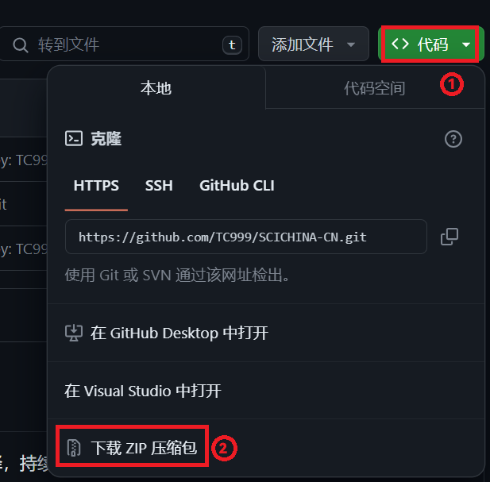

# SCICHINA-CN


本仓库用于收录中国科学英文杂志上的论文/文章的中文翻译，持续更新中

旨在帮助看不懂英文文献的人快速查找中文翻译

如果觉得这个项目很有用，请标星(`Star`)
## 使用方法
### **浏览器阅读**
- **注**：由于Github**不支持**`LaTex`公式渲染，在浏览器中阅读请安装插件[MathJax Plugin For Github](https://chromewebstore.google.com/detail/mathjax-plugin-for-github/ioemnmodlmafdkllaclgeombjnmnbima)

1. 查找文献：`Crtl`+`F`查找并搜索英文名称（如有作者姓名记得**删除**），
2. 点击英文名跳转原文（一般为PDF格式，不推荐）；点击中文名跳转中文翻译版本

## **本地阅读**
- **注1**：需要能够渲染`Markdown`的编辑器，例如[VSCode](https://code.visualstudio.com/)、[Obsidian](https://obsidian.md/)，需要安装能够渲染`LaTex`公式的插件
- **注2**：尽量不要使用Github安卓端打开，可能直接不显示（如下图）

1. 下载仓库到本地
- Windows、Linux、MacOS
  1) 浏览器下载：直接点击“代码”>>>下载ZIP压缩包
      - 注：下图使用了[Github中文化插件](https://github.com/maboloshi/github-chinese)
    
     
       
       下载完成后解压即可
  2) [Git](https://git-scm.com/downloads)命令行：终端输入以下命令并回车
      ```shell
      git clone https://github.com/TC999/SCICHINA-CN.git
      ```
  3) Github Desktop（注：需要Github账户）
- Android
  1) 浏览器下载：直接点击“代码”>>>下载ZIP压缩包
  2) Git命令行：
    - 需要安装[Termux](https://github.com/termux/termux-app)
    - 安装git
       ```
       pkg install git
       ```
       获得访问存储权限
       ```
       termux-setup-storage
       ```
       输入Y回车

       进入手机存储
       ```
       cd /sdcard/
       ```
       输入指令
       ```shell
       git clone https://github.com/TC999/SCICHINA-CN.git
       ```
2. 使用阅读器或编辑器打开整个文件夹，打开`README.md`
3. 查找文献：`Crtl`+`F`查找并搜索英文名称（如有作者姓名记得**删除**），
4. 点击英文名跳转原文（一般为PDF格式，不推荐）；点击中文名跳转中文翻译版本

## 已收录内容

### Infomation（信息科学）
|编号|英文名|中文译名|贡献者|
|:---:|:---:|:---:|:---:|
|第64卷 179105:1–179105:3|[Predicting accepted pull requests in GitHub](Information(信息)/Predicting-accepted-pull-requests-in-GitHub/EN-US.pdf)|[在GitHub中预测被接受的拉取请求](Information(信息)/Predicting-accepted-pull-requests-in-GitHub/ZH-CN.md)|[TC999](https://github.com/TC999)|

### Material（材料科学）
|编号|英文名|中文译名|贡献者|
|:---:|:---:|:---:|:---:|

## 贡献
  ### 提交翻译

  1. 复刻(`Fork`)本仓库
  2. 在对应的杂志中新建英文文件夹名，将空格替换为`-`，如带姓名将其删除
    - 例如：
      ```
      Predicting accepted pull requests in GitHub
      ```
      修改为
      ```
      Predicting-accepted-pull-requests-in-GitHub
      ```
  3. 在文件夹中放入原文文件（命名为`源语言编码.XXX`，例如英文为`EN_US.XXX`）和中文翻译(简体中文命名为`ZH_CN.XXX`，繁体中文命名为`ZH_TW.XXX`，推荐`*.md`格式)
  4. 修改`README.md`，填写表格，并添加文件相对路径，测试可以正常访问后提交拉取请求(`Pull Request`)，标题格式为`[添加/修正]`+`原文标题`+`(中文译名)`
   - 例如：
   ```
   [添加]Predicting accepted pull requests in GitHub(在GitHub中预测被接受的拉取请求)
   ```
   ```
   `[修正]Predicting accepted pull requests in GitHub(在GitHub中预测被接受的拉取请求)`
   ```

## 赞助

## 许可证
本项目采用[GPLv3许可证](LICENSE)。
